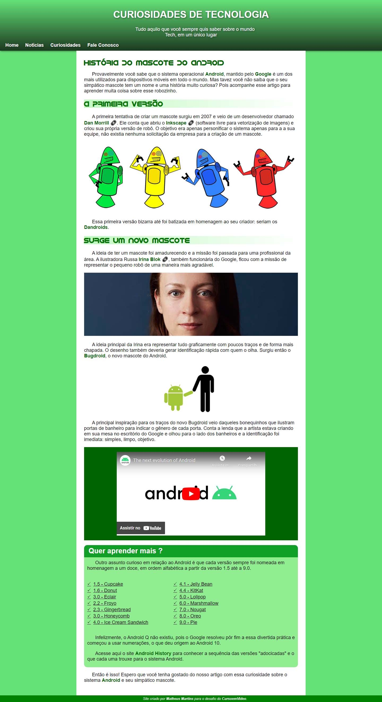
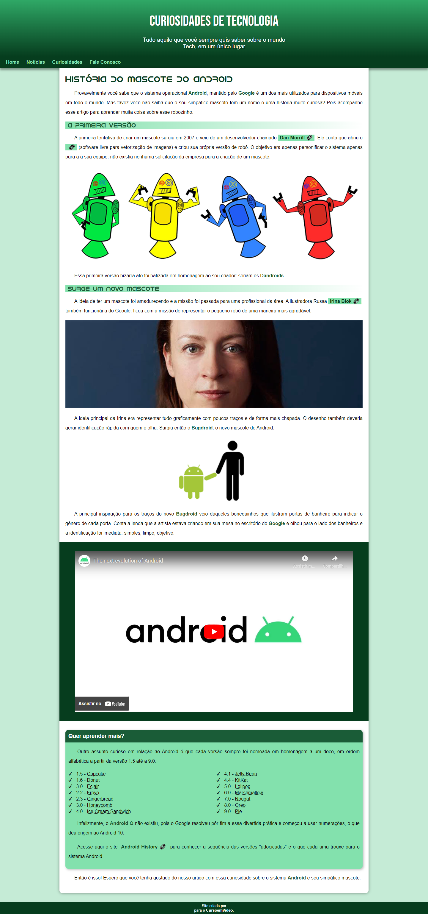

# 💻 Site-Android

Este é um site que apresenta informações sobre o sistema operacional Android e explora a criação do mascote do Android. O projeto foi desenvolvido utilizando HTML e CSS.

## 🌐 Demo

### Versão Inicial (Minha Versão)

### Correção de Gustavo Guanabara

## 🛠️ Tecnologias Utilizadas

- HTML
- CSS

## ✨ Recursos

- Informações sobre o sistema operacional Android
- História e criação do mascote do Android
- Links com efeito de hover
- Imagens responsivas

## 📢 Atenção

O conteúdo textual e as imagens utilizadas neste projeto foram fornecidos por Gustavo Guanabara, no curso em vídeo. O código foi escrito por mim, utilizando os recursos fornecidos por Gustavo Guanabara como exemplo. A versão inicial do projeto foi desenvolvida por mim e, posteriormente, corrigida com base nas orientações do Gustavo Guanabara. O objetivo do projeto é demonstrar as habilidades de desenvolvimento web e não possui fins comerciais.

## 👥 LinkedIn

Acesse meu perfil no LinkedIn: [Matheus no LinkedIn](https://www.linkedin.com/in/mattheus910)
